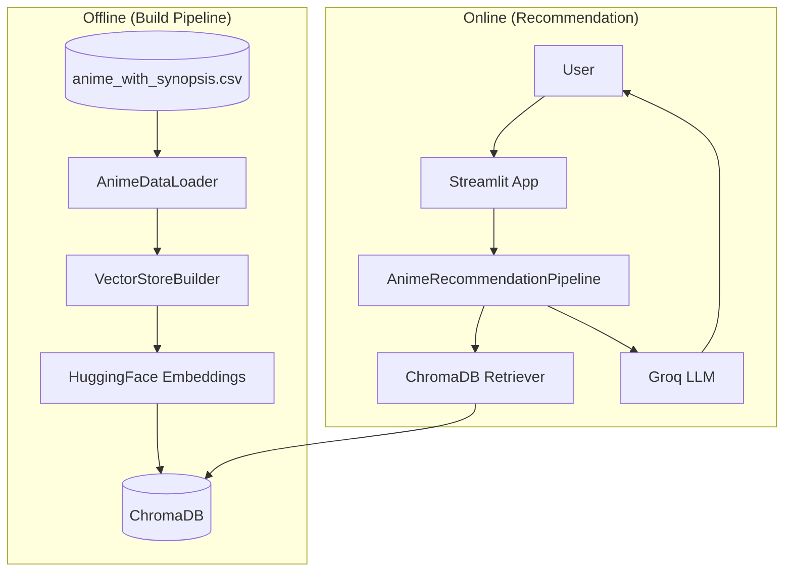
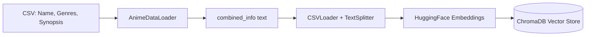
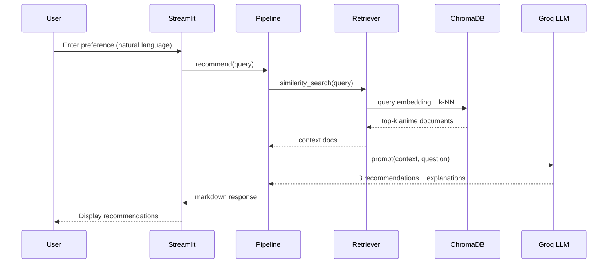
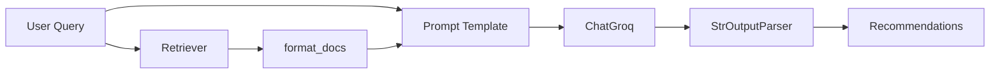
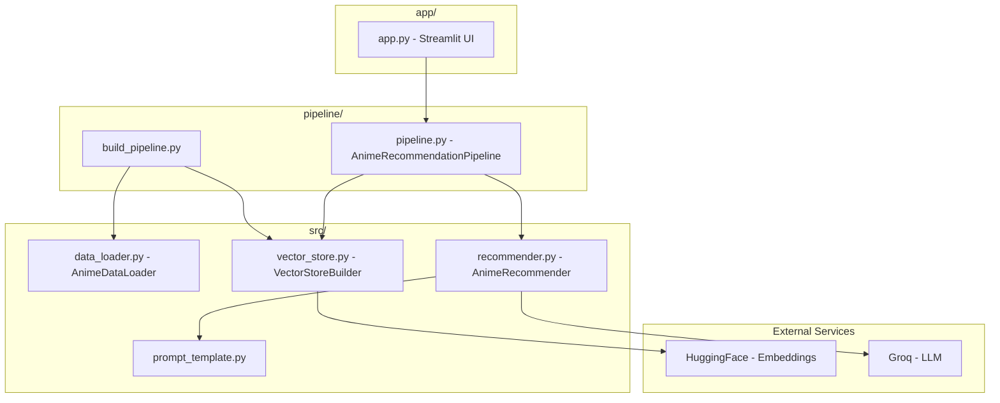

# AI Anime Recommender

An intelligent anime recommendation system that uses natural language processing and retrieval-augmented generation (RAG) to suggest anime titles based on user preferences.

## Overview

This project is a conversational anime recommender that allows users to describe the type of anime they are looking for in plain English. The system retrieves relevant anime from a knowledge base and uses a large language model to generate personalized recommendations with explanations.

For example, a user can ask for "light hearted anime with school settings" and receive three tailored recommendations, each with a plot summary and explanation of why it matches their preferences.

## System Design

### High-Level Architecture



### Data Pipeline (Offline)



### Recommendation Pipeline (Online)



### RAG Chain (LCEL)



### Component Overview



## How It Works

The system operates in two stages:

### 1. Data Pipeline (Offline)

The build pipeline processes anime data and creates a searchable vector database:

- Loads anime data from a CSV file containing titles, genres, and synopses
- Combines the information into a unified text format for each anime
- Generates vector embeddings using a HuggingFace sentence transformer model
- Stores the embeddings in a ChromaDB vector database for efficient similarity search

### 2. Recommendation Pipeline (Online)

When a user submits a query through the web interface:

- The query is converted to a vector embedding
- ChromaDB retrieves the most relevant anime based on semantic similarity
- The retrieved anime information is passed as context to a Groq-hosted LLM
- The LLM generates a response with three anime recommendations, including plot summaries and personalized explanations

## Technology Stack

- **LangChain**: Framework for building the RAG pipeline and orchestrating LLM interactions
- **ChromaDB**: Vector database for storing and retrieving anime embeddings
- **Groq**: Fast LLM inference API for generating recommendations
- **HuggingFace Embeddings**: Sentence transformer model for creating semantic embeddings
- **Streamlit**: Web interface for user interaction
- **Pandas**: Data processing and CSV handling

## Project Structure

```
AI-Anime-Recommender/
├── app/
│   └── app.py              # Streamlit web application
├── config/
│   └── config.py           # Configuration and environment variables
├── data/
│   └── anime_with_synopsis.csv  # Source anime data
├── pipeline/
│   ├── build_pipeline.py   # Script to build the vector database
│   └── pipeline.py         # Recommendation pipeline class
├── src/
│   ├── data_loader.py      # CSV loading and preprocessing
│   ├── vector_store.py     # ChromaDB vector store operations
│   ├── recommender.py      # LLM-based recommendation logic
│   └── prompt_template.py  # Prompt template for the LLM
├── utils/
│   ├── logger.py           # Logging configuration
│   └── custom_exception.py # Custom exception handling
├── requirements.txt        # Python dependencies
└── setup.py                # Package setup file
```

## Setup

### Prerequisites

- Python 3.13 or compatible version
- Groq API key
- HuggingFace access token

### Installation

1. Clone the repository and navigate to the project directory

2. Create and activate a virtual environment:
   ```bash
   python3 -m venv venv
   source venv/bin/activate
   ```

3. Install the package in development mode:
   ```bash
   pip install -e .
   ```

4. Create a `.env` file with your API keys (see `.env.example` for the required format):
   ```
   GROQ_API_KEY=your_groq_api_key
   HF_TOKEN=your_huggingface_token
   ```

### Building the Vector Database

Run the build pipeline to process the anime data and create the vector store:

```bash
python -m pipeline.build_pipeline
```

This only needs to be done once, or when the source data changes.

### Running the Application

Start the Streamlit web application:

```bash
streamlit run app/app.py
```

The application will open in your browser where you can enter your anime preferences and receive recommendations.

## Usage

1. Open the web interface in your browser
2. Enter a description of the anime you are looking for (e.g., "action anime with strong female lead", "relaxing slice of life with cooking themes")
3. Wait for the system to generate recommendations
4. Review the three suggested anime with their summaries and explanations

## Author

Long
